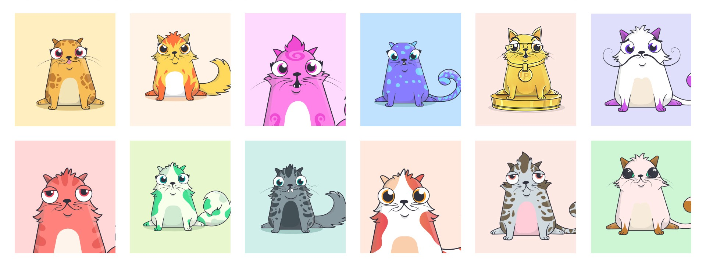

# ERC Token Standards
Ethereum's ERC (Ethereum Request for Comment) proposals are technical documents that define a set of rules used when implementing tokens for the Ethereum ecosystem.

## Common token standards

### ERC-20
The most commonly used Ethereum token standard is the ERC-20 token. An ERC-20 compatible smart contract can create anywhere from `0` to `(2^256-1)/10^18` ERC-20 tokens. These tokens are fungible in nature, and each token is alike the other. There is no differentiating factor between individual tokens. ERC-20 tokens are divisible from `0` to `18` decimal places.

ERC-20 tokens can be transferred between individuals and queried for balance, enabling their usage as non-Ether currencies on the Ethereum blockchain. As such, these tokens are commonly used for crowd-funding and investment in blockchain projects.

**Note:** ERC-20 tokens are limited to a single token issuance event, which prevents their supply from being altered post-contract-deployment. As a result, it is commonplace to see projects holding arbitrary reserves of their ERC-20 tokens to alter token supply in circulation.

Common examples of ERC-20 tokens include:

- [Maker (MKR)](https://makerdao.com/): Used to pay transaction fees in the Maker ecosystem, and provides holders voting rights within Maker's continuous approval voting system.
- [Basic Attention Token (BAT)](https://basicattentiontoken.org/): Digital advertising token used on the Brave ad exchange marketplace, and to reward users of the Brave browser.
- [Augur Reputation Token (REP)](https://www.augur.net/): Staking token used to vet results on the decentralized predictions market. Users earn REP for successful vetting.

### ERC-621
ERC-621 tokens are an extension of ERC-20 tokens that include the functions to `increaseSupply` and `decreaseSupply`. Via these functions, contract owners are able to modify the total supply of tokens in circulation after contract deployment.

### ERC-721
ERC-721 tokens are non-fungible tokens. In contrast to ERC-20 tokens, which have a fixed supply and each unit of a token is equal to a unit of another, ERC-721 tokens are unidentical from another. Each token is unique, enabling unidentical parameters, valuation (pricing), and purpose. 

Programatically, this is usually executed through usage of the standards `tokenMetadata` property which enables storing references to off-chain data about a token. Data is commonly stored off-chain due to the limitations of storage on the Ethereum blockchain and the expense.

A commonly used example of ERC-721 tokens are [CryptoKitties](https://www.cryptokitties.co/): collectible, digital cats. Due to their non-fungible nature, each unique CryptoKitty (with its own appearance, parameters, etc.) is backed by a unique, differentiable token. As a result, varying types of CryptoKitties can have differing prices. This is in contrast to ERC-20, where each token must have the same price as the other (due to their indistinguishable nature).
